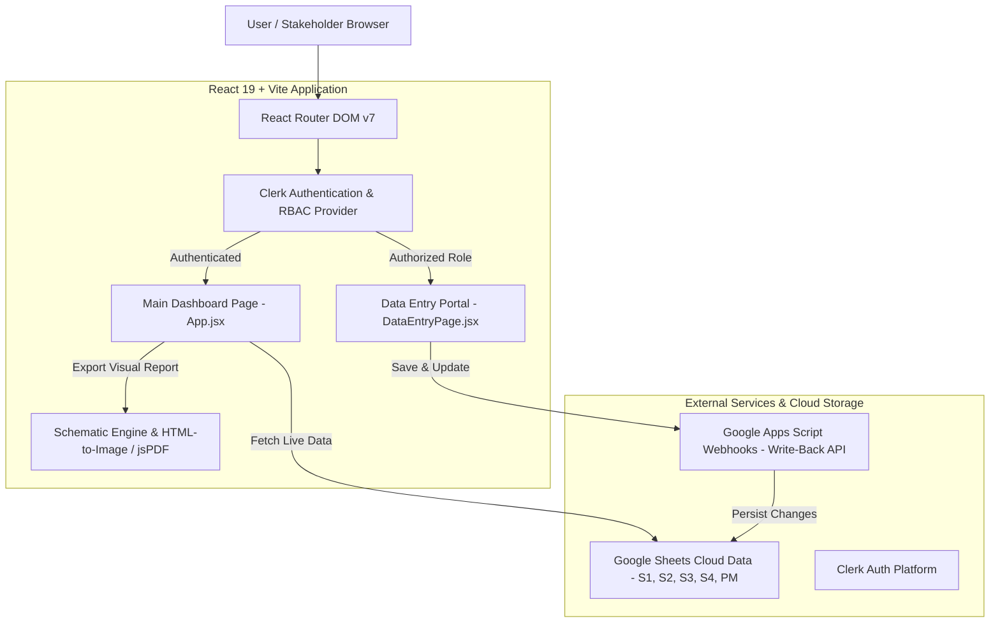

# 🚅 MAHSR C3 Progress Schematic Dashboard

An enterprise-grade, interactive visual tracking and reporting system designed for the **Mumbai-Ahmedabad High-Speed Rail (MAHSR) Project – Package C3**. 

This application empowers executive stakeholders, project managers, site engineers, and field operations teams to monitor, update, and analyze civil infrastructure progress across foundations, piers, pier caps, launching girders (LG), and superstructure span segments in real time.

---

## 📋 Table of Contents
- [Executive Overview](#-executive-overview)
- [Key Features](#-key-features)
- [System Architecture](#-system-architecture)
- [Technology Stack](#-technology-stack)
- [Data Model & Integration](#-data-model--integration)
- [Role-Based Access Control (RBAC)](#-role-based-access-control-rbac)
- [Project Directory Structure](#-project-directory-structure)
- [Environment Configuration](#-environment-configuration)
- [Getting Started & Installation](#-getting-started--installation)
- [Available Scripts](#-available-scripts)
- [Operational Workflows](#-operational-workflows)

---

## 🎯 Executive Overview

The **MAHSR C3 Progress Schematic Dashboard** bridges the gap between field construction data and executive decision-making. High-speed rail civil works require tracking hundreds of piers and thousands of precast superstructure segments. 

This platform transforms static spreadsheet records into an intuitive, color-coded interactive schematic. It provides instant visibility into project milestones, identifies bottlenecks, tracks monthly progress against target scopes, and enables secure field data updates.

### Target Audience & Stakeholders
* **Executive Leadership & Board Members**: High-level progress metrics (Planned vs. Achieved, For-The-Month (FTM), Previous Day progress).
* **Project Managers (PMs)**: Zone-specific filtering for assigned Pier ID ranges (e.g., Section 1 PM 1: `21P01` to `21P40`).
* **Site Engineers & Supervisors**: Direct data entry interface for updating casting, erection, and substructure statuses.
* **Planning & Quality Teams**: Quick auditing of drawing availability and segment casting/erection timelines.

---

## ✨ Key Features

### 1. Interactive Schematic Visualization
* **Dynamic Component Rendering**: Visual representation of Foundation (Anchor), Pier (Building Structure), and Pier Cap (Columns) per Pier ID.
* **Superstructure Segment Mapping**: Color-coded segments per span according to real-time status:
  * 🟩 **Green**: Completed / Erected
  * 🟦 **Blue**: Cast / Ready for Erection
  * 🟥 **Red**: Drawing Unavailable / Blocked
  * ⬜ **White/Slate**: Pending / In-Progress
* **Launching Girder (LG) Movement Direction**: Directional arrows (Left-to-Right or Right-to-Left) indicating active girder positioning.
* **Span Navigation**: Instant jump-to-span navigation with visual highlight animations.

### 2. Multi-Section & C3 Package Aggregation
* **Section-by-Section View**: Switch seamlessly between **Section 1 (S1)**, **Section 2 (S2)**, **Section 3 (S3)**, and **Section 4 (S4)**.
* **Full C3 Package Mode**: Toggle the **C3 Package Switch** to aggregate and inspect all 4 sections simultaneously.

### 3. Executive KPI & Progress Metrics
* **Live Summary Analytics**: Auto-calculated statistics showing **Scope**, **Achieved**, **FTM (For The Month)**, and **Prev Day** counts.
* **Superstructure Type Breakdown**: Granular metrics for span types including **SBS** (Span-by-Span), **FSLM** (Full Span Launching Method), **CEM**, and **GAD**.
* **Date Range Filtering**: Custom date range picker (`From Date` → `To Date`) to analyze progress made during specific reporting cycles.

### 4. Direct Data Entry & Live Write-Back Portal
* **Dedicated Data Entry Route (`/data-entry`)**: Built-in operational view for field personnel.
* **Substructure & Segment Editors**: Batch update Foundation, Pier, PierCap status, casting dates, and erection dates per segment.
* **Google Sheets Sync**: Direct write-back integration via Google Apps Script webhooks to persist updates to the central cloud spreadsheet repository.

### 5. Multi-Format Data Parser & Auto-Sync
* **Universal Parser**: Automatic handling of Excel (`.xlsx`), CSV feeds, Excel serial dates, ISO dates (`YYYY-MM-DD`), and regional date strings (`DD/MM/YYYY`).
* **No-Cache Live Sync**: Background cache-busting fetching mechanism ensuring live synchronization without manual page refreshes.

### 6. High-Definition PDF Reporting
* **Landscape Executive Exports**: One-click high-resolution PDF export (`A3` format) of the active schematic dashboard, formatted specifically for printing and executive presentations.

---

## 🏗 System Architecture



---

## 🛠 Technology Stack

### Frontend Core & Infrastructure
| Tech / Library | Version | Purpose |
| :--- | :--- | :--- |
| **React** | `^19.2.0` | Core UI library for component-driven interface |
| **Vite** | `^7.3.1` | Next-generation frontend tooling and fast dev server |
| **React Router DOM** | `^7.15.1` | Client-side routing (`/` Dashboard, `/data-entry` Data Portal) |
| **Tailwind CSS** | `^4.2.1` | Modern utility-first CSS framework for responsive design |
| **Lucide React** | `^0.575.0` | Comprehensive iconography system |

### Data Processing & Utilities
| Tech / Library | Version | Purpose |
| :--- | :--- | :--- |
| **SheetJS (`xlsx`)** | `^0.18.5` | Parsing binary Excel files (`.xlsx`) directly in the browser |
| **PapaParse** | `^5.5.3` | High-performance CSV parsing and string formatting |

### Authentication & Security
| Tech / Library | Version | Purpose |
| :--- | :--- | :--- |
| **Clerk React (`@clerk/react`)** | `^6.7.1` | Enterprise authentication, user management, and org-based RBAC |

### Reporting & Media Generation
| Tech / Library | Version | Purpose |
| :--- | :--- | :--- |
| **jsPDF** | `^4.2.0` | Programmatic PDF document generation |
| **html-to-image** | `^1.11.13` | Converting DOM nodes into high-DPI canvas/PNG images for export |

---

## 📊 Data Model & Integration

The system consumes data structured across 5 primary worksheets:
1. **Section 1 (S1) Sheet**: Pier-by-pier data for Section 1.
2. **Section 2 (S2) Sheet**: Pier-by-pier data for Section 2.
3. **Section 3 (S3) Sheet**: Pier-by-pier data for Section 3.
4. **Section 4 (S4) Sheet**: Pier-by-pier data for Section 4.
5. **Project Manager (PM) Mapping Sheet**: Maps PM names to specific Pier ID ranges (e.g. `21P01-21P40`).

### Schema Definition per Pier / Span Entry
```typescript
interface PierSpanRow {
  "Pier ID": string;                        // e.g. "21P01"
  "Span ID": string;                        // e.g. "21P01-21P02"
  "Type": "SBS" | "FSLM" | "CEM" | "GAD";   // Superstructure methodology
  "No of Segments": number;                 // e.g. 10 segments in span
  
  // Substructure Fields
  "Foundation_Status"?: "Not Started" | "In Progress" | "Completed";
  "Foundation_Completed_Date"?: string;
  "Foundation Drawing Status"?: string;

  "Pier_Status"?: "Not Started" | "In Progress" | "Completed";
  "Pier_Completed_Date"?: string;
  "Pier Drawing Status"?: string;

  "PierCap_Status"?: "Not Started" | "In Progress" | "Completed";
  "PierCap_Completed_Date"?: string;
  "Pier Cap Drawing Status"?: string;

  // Segment Fields (Dynamic for S01 to S14+)
  [key: `S${number}_Casting_Status`]: "Not Started" | "In Progress" | "Completed";
  [key: `S${number}_Casting_Date`]: string;
  [key: `S${number}_Erection_Status`]: "Not Started" | "In Progress" | "Completed";
  [key: `S${number}_Erection_Date`]: string;

  // Launching Girder Metadata
  "LG_Movement_Direction"?: string;         // "Left to Right", "Right to Left", etc.
  "Girder_Location_Span_ID"?: string;
}
```

---

## 🔐 Role-Based Access Control (RBAC)

Authentication and permissions are governed through **Clerk Organization Roles**:

| User Role | View Dashboard (`/`) | Filter & Search | Export PDF | Edit Data (`/data-entry`) | Sync to Cloud |
| :--- | :---: | :---: | :---: | :---: | :---: |
| **Unauthenticated** | ❌ (Login Prompt) | ❌ | ❌ | ❌ | ❌ |
| **Org Member (`org:member`)** | ✅ | ✅ | ✅ | 👁 Read-Only | ❌ |
| **Org Admin / Manager** | ✅ | ✅ | ✅ | ✏️ Full Edit | ✅ |

---

## 📁 Project Directory Structure

```
sitehelper/
├── public/
│   ├── logo2.png                 # Enterprise brand logo asset
│   └── favicon.ico               # Application favicon
├── src/
│   ├── components/
│   │   └── data-entry/
│   │       ├── DataEntryPage.jsx # Main data entry page & sheet synchronization logic
│   │       ├── SegmentTable.jsx  # Interactive tabular editor for segment casting/erection
│   │       └── StatusCard.jsx    # Status editor component for foundation, pier & cap
│   ├── App.jsx                   # Main schematic dashboard renderer & KPI summary engine
│   ├── App.css                   # Specialized dashboard styling and print layouts
│   ├── main.jsx                  # Application entry point with Clerk & Router wrappers
│   └── index.css                 # Base Tailwind CSS directives & global resets
├── .env                          # Cloud Sheet & Clerk environment keys (see below)
├── vite.config.js                # Vite build and plugin settings
├── eslint.config.js              # ESLint linting configuration
└── package.json                  # Dependencies and execution scripts
```

---

## ⚙️ Environment Configuration

Create a `.env` file in the project root with the following mandatory parameters:

```env
# 📊 Google Sheet Read Endpoints (Export Formats: XLSX or CSV)
VITE_SHEET_URL_S1=https://docs.google.com/spreadsheets/d/<SHEET_ID>/export?format=xlsx&gid=0
VITE_SHEET_URL_S2=https://docs.google.com/spreadsheets/d/<SHEET_ID>/export?format=xlsx&gid=897503370
VITE_SHEET_URL_S3=https://docs.google.com/spreadsheets/d/<SHEET_ID>/export?format=xlsx&gid=986110663
VITE_SHEET_URL_S4=https://docs.google.com/spreadsheets/d/<SHEET_ID>/export?format=xlsx&gid=1148765001

# 👤 Project Manager Mapping Sheet Endpoint
VITE_SHEET_URL_PM=https://docs.google.com/spreadsheets/d/e/<PUBLISHED_ID>/pub?gid=49962826&single=true&output=csv

# 🔐 Clerk Authentication Credentials
VITE_CLERK_PUBLISHABLE_KEY=pk_test_...
CLERK_SECRET_KEY=sk_test_...

# 📝 Google Apps Script Write-Back Webhooks (For Data Entry Portal)
VITE_SHEET_WRITE_URL_S1=https://script.google.com/macros/s/<SCRIPT_ID>/exec
VITE_SHEET_WRITE_URL_S2=https://script.google.com/macros/s/<SCRIPT_ID>/exec
VITE_SHEET_WRITE_URL_S3=https://script.google.com/macros/s/<SCRIPT_ID>/exec
VITE_SHEET_WRITE_URL_S4=https://script.google.com/macros/s/<SCRIPT_ID>/exec
```

---

## 🚀 Getting Started & Installation

### Prerequisites
* **Node.js**: `v18.0.0` or higher
* **npm**: `v9.0.0` or higher

### Step-by-Step Installation

1. **Clone the repository**:
   ```bash
   git clone https://github.com/your-org/mahsh-c3-dashboard.git
   cd sitehelper
   ```

2. **Install dependencies**:
   ```bash
   npm install
   ```

3. **Configure Environment Variables**:
   Copy or configure your `.env` file in the project root as detailed above.

4. **Launch Development Server**:
   ```bash
   npm run dev
   ```
   The application will start locally at `http://localhost:5173`.

---

## 📜 Available Scripts

In the project directory, you can run:

* `npm run dev`: Starts the local development server with Vite Hot Module Replacement (HMR).
* `npm run build`: Bundles the application for production deployment into the `dist/` folder.
* `npm run preview`: Locally previews the production build.
* `npm run lint`: Runs ESLint checks across all `.js` and `.jsx` source files.

---

## 🔄 Operational Workflows

### 1. Daily Site Monitoring Workflow
1. Log into the dashboard at `/`.
2. Select desired **Section** (`S1` to `S4`) or enable **C3 Package Mode**.
3. Select your assigned **Project Manager** name to focus on specific pier ranges.
4. Input a custom **Date Range** to audit work completed during the recent reporting window.
5. Inspect foundation, pier, pier cap, and segment completion indicators.

### 2. Field Data Entry & Status Update Workflow
1. Navigate to `/data-entry` (or click **Data Entry** in the top bar).
2. Select the target **Section** and search for the specific **Pier ID**.
3. Update foundation/pier/piercap statuses and completion dates.
4. Edit individual segment casting and erection statuses and dates in the interactive segment table.
5. Click **Save Changes** to push live updates to the central Google Sheet repository.

### 3. Executive Report Generation
1. Adjust the dashboard controls to display the desired section, date range, or manager view.
2. Click the **Export PDF** button on the dashboard header.
3. The platform will automatically render the entire schematic view into a multi-page, publication-quality A3 landscape PDF document.

---

## 📄 License & Attribution

Internal application developed for the **Mumbai-Ahmedabad High-Speed Rail (MAHSR) Project – Package C3**. All rights reserved.
